

   

<h1 align="center">
Codigrate Themes for Chrome
</h1>

A carefully crafted collection of Chrome themes inspired by nature and iconic cities around the world.
Each theme is designed with balance, readability, and everyday browsing comfort in mind—blending distinctive atmospheres
with thoughtfully tuned colors that make your browser feel both elegant and personal.
Whether you prefer calm, light environments or deep, immersive dark palettes,
these themes aim to make your browsing experience visually inspiring and comfortably refined.

## Getting Started

1. Open the Chrome Web Store.
2. Search for **the name of the theme**.
3. Open the theme page and click **Add to Chrome**.
4. Once installed, Chrome will automatically apply the theme to your browser.

## Notes

- These themes are designed for **Google Chrome**.
- If you want to remove a theme, open Chrome settings and reset the theme to default.
- Theme appearance may vary slightly depending on your operating system, Chrome version, and display settings.

## Nature

   

<h1 align="center">
Everest
</h1>

## Description

Inspired by the majestic heights and serene landscapes of Mount Everest, this light theme brings a crisp and calming
presence to Chrome. Soft icy tones and clean, airy surfaces evoke snow-covered peaks and clear mountain skies,
creating a browsing experience that feels fresh, focused, and easy on the eyes.

## Screenshots

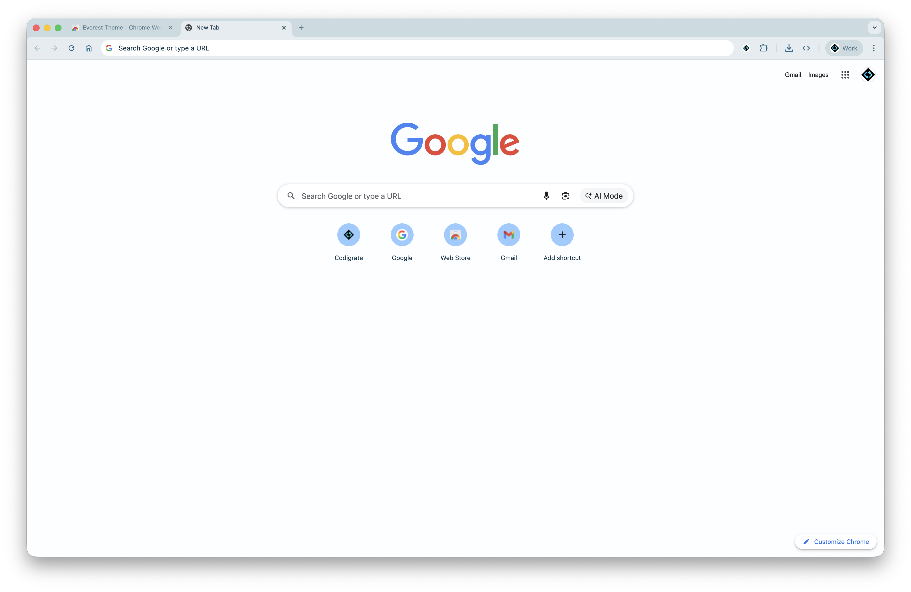

## Color Palette

<table>
   <tr>
      <td></td>
      <td>
         Background
      </td>
      <td>
         <a href="https://codigrate.com/en-US/tools/color/FDFEFF">#FDFEFF</a>
      </td>
   </tr>
   <tr>
      <td></td>
      <td>
         Frame
      </td>
      <td>
         <a href="https://codigrate.com/en-US/tools/color/CADAE0">#CADAE0</a>
      </td>
   </tr>
   <tr>
      <td></td>
      <td>
         Accent
      </td>
      <td>
         <a href="https://codigrate.com/en-US/tools/color/246A89">#246A89</a>
      </td>
   </tr>
</table>

---

   <a href="https://chromewebstore.google.com/detail/ggdeckhhnhopdjnnbngcflijkhnlodfk">
      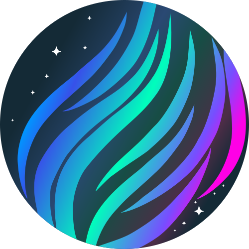
   </a>

<h1 align="center">
Aurora Borealis
</h1>

## Description

Inspired by the natural phenomena of the Aurora Borealis, this dark theme captures the majesty and mystery of the Arctic
night sky. Deep blue-green tones shape the browser frame, while luminous accents echo the ethereal colors of the Northern
Lights, creating a browsing atmosphere that feels immersive, calm, and vibrant.

## Screenshots

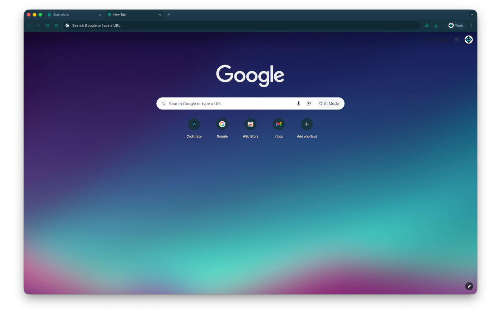

## Color Palette

<table>
   <tr>
      <td></td>
      <td>
         Background
      </td>
      <td>
         <a href="https://codigrate.com/en-US/tools/color/142B37">#142B37</a>
      </td>
   </tr>
   <tr>
      <td></td>
      <td>
         Frame
      </td>
      <td>
         <a href="https://codigrate.com/en-US/tools/color/1C3847">#1C3847</a>
      </td>
   </tr>
   <tr>
      <td></td>
      <td>
         Accent
      </td>
      <td>
         <a href="https://codigrate.com/en-US/tools/color/049682">#049682</a>
      </td>
   </tr>
</table>

---

   

<h1 align="center">
Sakura
</h1>

## Description

Inspired by the enchanting softness of Sakura blossoms, this theme brings a delicate spring atmosphere to Chrome.
Gentle pinks and muted complementary tones create a serene, polished browser experience that feels light, graceful,
and easy to live with throughout the day.

## Screenshots

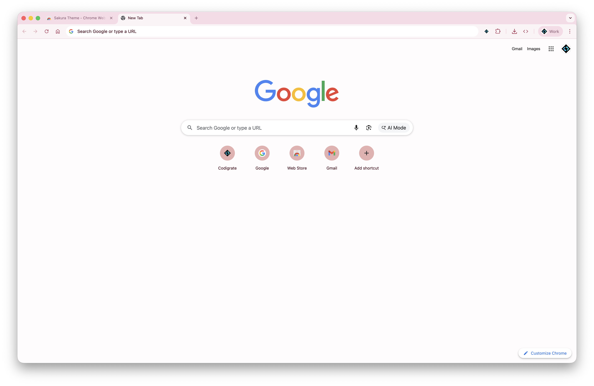

## Color Palette

<table>
   <tr>
      <td></td>
      <td>
         Background
      </td>
      <td>
         <a href="https://codigrate.com/en-US/tools/color/FEFCFC">#FEFCFC</a>
      </td>
   </tr>
   <tr>
      <td></td>
      <td>
         Frame
      </td>
      <td>
         <a href="https://codigrate.com/en-US/tools/color/F8DBE6">#F8DBE6</a>
      </td>
   </tr>
   <tr>
      <td></td>
      <td>
         Accent
      </td>
      <td>
         <a href="https://codigrate.com/en-US/tools/color/B54B66">#B54B66</a>
      </td>
   </tr>
</table>

---

   

<h1 align="center">
Sequoia
</h1>

## Description

Inspired by the towering presence and grounded calm of sequoias, this dark theme surrounds Chrome with rich woodland
tones and subtle green life. It creates a focused, earthy atmosphere that feels steady, deep, and comfortably subdued.

## Screenshots

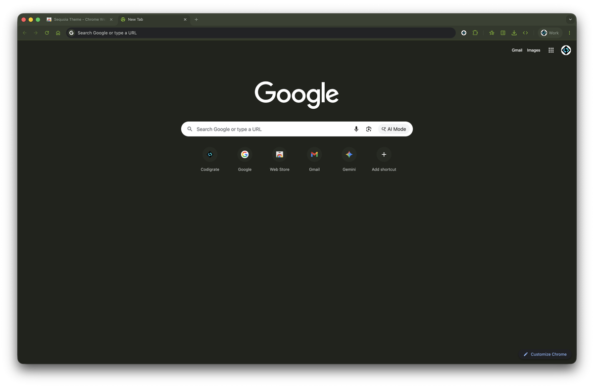

## Color Palette

<table>
   <tr>
      <td></td>
      <td>
         Background
      </td>
      <td>
         <a href="https://codigrate.com/en-US/tools/color/20231C">#20231C</a>
      </td>
   </tr>
   <tr>
      <td></td>
      <td>
         Frame
      </td>
      <td>
         <a href="https://codigrate.com/en-US/tools/color/394132">#394132</a>
      </td>
   </tr>
   <tr>
      <td></td>
      <td>
         Accent
      </td>
      <td>
         <a href="https://codigrate.com/en-US/tools/color/73A621">#73A621</a>
      </td>
   </tr>
</table>

---

   

<h1 align="center">
Autumn
</h1>

## Description

Inspired by the warm hues and rustic charm of autumn, this light theme brings soft seasonal comfort to Chrome.
Earthy oranges, mellow neutrals, and crisp contrast create a cozy browsing space that feels welcoming, balanced,
and quietly expressive.

## Screenshots

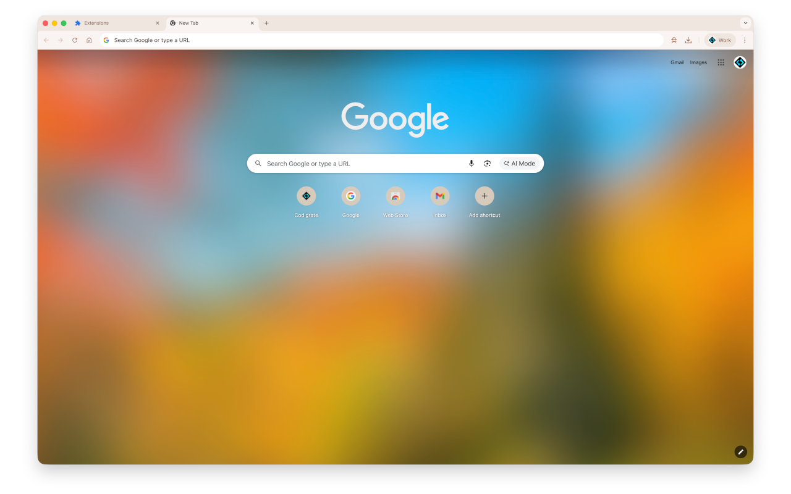

## Color Palette

<table>
   <tr>
      <td></td>
      <td>
         Background
      </td>
      <td>
         <a href="https://codigrate.com/en-US/tools/color/FCFBFA">#FCFBFA</a>
      </td>
   </tr>
   <tr>
      <td></td>
      <td>
         Frame
      </td>
      <td>
         <a href="https://codigrate.com/en-US/tools/color/EFE6E0">#EFE6E0</a>
      </td>
   </tr>
   <tr>
      <td></td>
      <td>
         Accent
      </td>
      <td>
         <a href="https://codigrate.com/en-US/tools/color/A7714C">#A7714C</a>
      </td>
   </tr>
</table>

---

   

<h1 align="center">
Roraima
</h1>

## Description

Inspired by the dramatic sunset over Mount Roraima, this dark theme blends dusky purples, ember-like oranges,
and twilight shadows into a bold yet balanced browser palette. It brings warmth, depth, and a cinematic sense
of atmosphere to everyday browsing.

## Screenshots

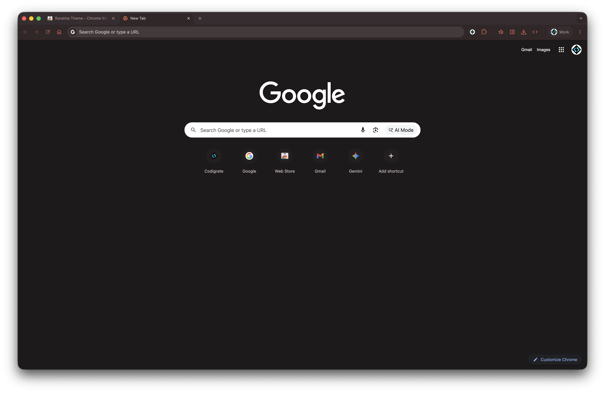

## Color Palette

<table>
   <tr>
      <td></td>
      <td>
         Background
      </td>
      <td>
         <a href="https://codigrate.com/en-US/tools/color/1E1A1B">#1E1A1B</a>
      </td>
   </tr>
   <tr>
      <td></td>
      <td>
         Frame
      </td>
      <td>
         <a href="https://codigrate.com/en-US/tools/color/372C2F">#372C2F</a>
      </td>
   </tr>
   <tr>
      <td></td>
      <td>
         Accent
      </td>
      <td>
         <a href="https://codigrate.com/en-US/tools/color/CC654E">#CC654E</a>
      </td>
   </tr>
</table>

## Cities

   

<h1 align="center">
Istanbul
</h1>

## Description

Inspired by the soft daylight and sea breezes of Istanbul, this theme brings airy turquoise tones and warm historical
accents into Chrome. It feels fresh, calm, and expressive, offering a refined browsing atmosphere with a distinct coastal elegance.

## Screenshots

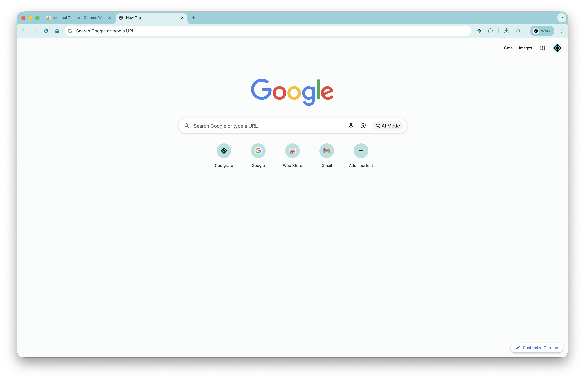

## Color Palette

<table>
   <tr>
      <td></td>
      <td>
         Background
      </td>
      <td>
         <a href="https://codigrate.com/en-US/tools/color/FAFDFD">#FAFDFD</a>
      </td>
   </tr>
   <tr>
      <td></td>
      <td>
         Frame
      </td>
      <td>
         <a href="https://codigrate.com/en-US/tools/color/91D1DA">#91D1DA</a>
      </td>
   </tr>
   <tr>
      <td></td>
      <td>
         Accent
      </td>
      <td>
         <a href="https://codigrate.com/en-US/tools/color/087E8E">#087E8E</a>
      </td>
   </tr>
</table>

---

   

<h1 align="center">
Miami
</h1>

## Description

Inspired by the electric nights and pastel sunsets of Miami, this dark theme fills Chrome with bold purples,
vivid pinks, tropical teals, and warm neon energy. It creates a playful yet polished browsing experience with
strong personality and clear visual contrast.

## Screenshots

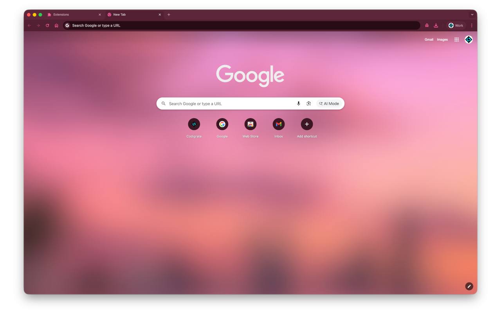

## Color Palette

<table>
   <tr>
      <td></td>
      <td>
         Background
      </td>
      <td>
         <a href="https://codigrate.com/en-US/tools/color/33121D">#33121D</a>
      </td>
   </tr>
   <tr>
      <td></td>
      <td>
         Frame
      </td>
      <td>
         <a href="https://codigrate.com/en-US/tools/color/5D263A">#5D263A</a>
      </td>
   </tr>
   <tr>
      <td></td>
      <td>
         Accent
      </td>
      <td>
         <a href="https://codigrate.com/en-US/tools/color/FF5FA2">#FF5FA2</a>
      </td>
   </tr>
</table>

---

   

<h1 align="center">
Rio de Janeiro
</h1>

## Description

Inspired by Rio's lush hills, bright air, and coastal energy, this theme blends soft minty tones with vibrant greens
and clean blues to create a light, refreshing Chrome experience that feels lively, open, and balanced.

## Screenshots

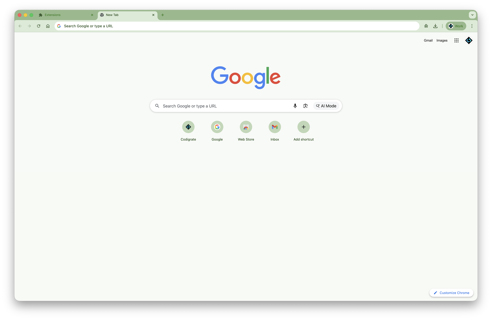

## Color Palette

<table>
   <tr>
      <td></td>
      <td>
         Background
      </td>
      <td>
         <a href="https://codigrate.com/en-US/tools/color/F7FAF6">#F7FAF6</a>
      </td>
   </tr>
   <tr>
      <td></td>
      <td>
         Frame
      </td>
      <td>
         <a href="https://codigrate.com/en-US/tools/color/94B98B">#94B98B</a>
      </td>
   </tr>
   <tr>
      <td></td>
      <td>
         Accent
      </td>
      <td>
         <a href="https://codigrate.com/en-US/tools/color/375B2E">#375B2E</a>
      </td>
   </tr>
</table>

---

   <a href="https://chromewebstore.google.com/detail/jcneihnpahfoamjdncacanalmdiokkbj">
      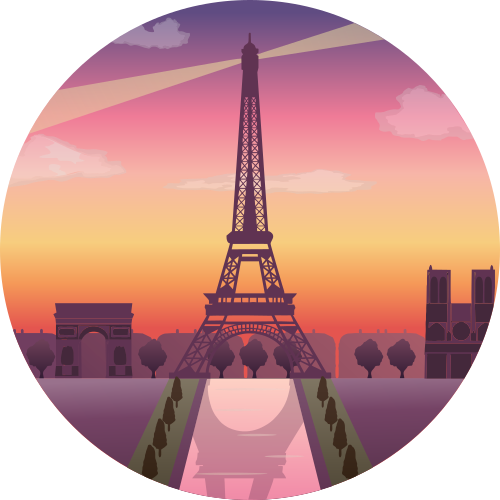
   </a>

<h1 align="center">
Paris
</h1>

## Description

Inspired by candlelit cafes, stone boulevards, and Paris's late-night glow, this theme brings dusky rose,
plum-espresso depth, and soft blush accents into Chrome. It feels romantic, moody, and elegant without losing clarity.

## Screenshots

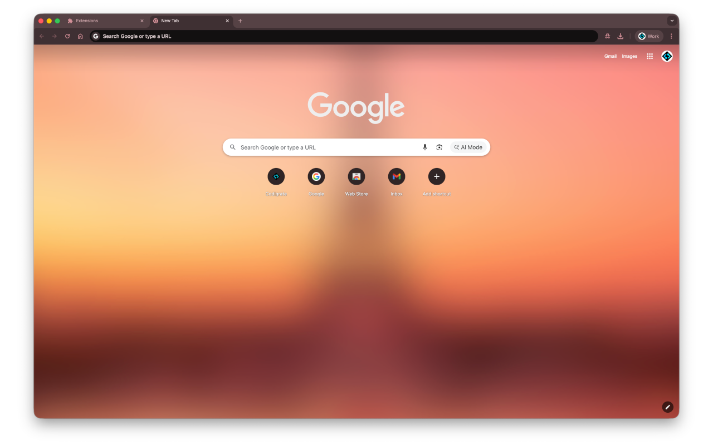

## Color Palette

<table>
   <tr>
      <td></td>
      <td>
         Background
      </td>
      <td>
         <a href="https://codigrate.com/en-US/tools/color/271F20">#271F20</a>
      </td>
   </tr>
   <tr>
      <td></td>
      <td>
         Frame
      </td>
      <td>
         <a href="https://codigrate.com/en-US/tools/color/564245">#564245</a>
      </td>
   </tr>
   <tr>
      <td></td>
      <td>
         Accent
      </td>
      <td>
         <a href="https://codigrate.com/en-US/tools/color/D39199">#D39199</a>
      </td>
   </tr>
</table>

---

   

<h1 align="center">
Tallinn
</h1>

## Description

Inspired by Tallinn's crisp light and Baltic calm, this theme pairs cool porcelain tones with Nordic blues for a browser
experience that feels clean, minimal, and quietly elegant. Subtle contrast keeps everything fresh and readable.

## Screenshots

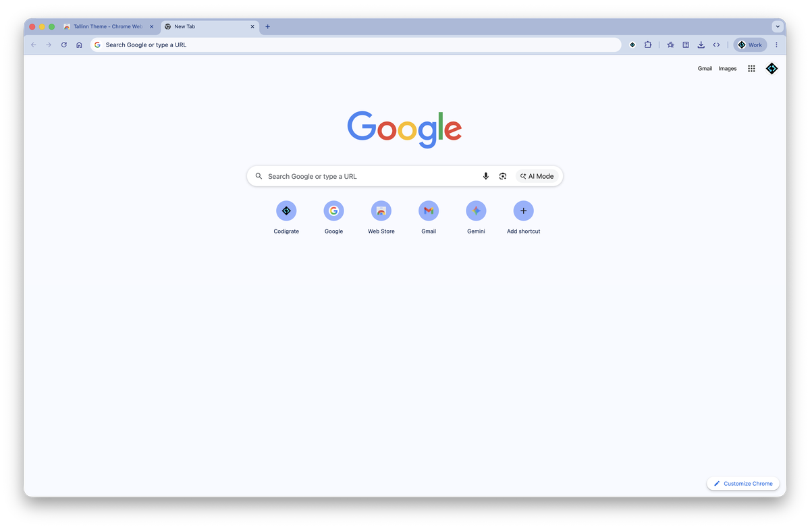

## Color Palette

<table>
   <tr>
      <td></td>
      <td>
         Background
      </td>
      <td>
         <a href="https://codigrate.com/en-US/tools/color/EDF2FA">#EDF2FA</a>
      </td>
   </tr>
   <tr>
      <td></td>
      <td>
         Frame
      </td>
      <td>
         <a href="https://codigrate.com/en-US/tools/color/A9B9DA">#A9B9DA</a>
      </td>
   </tr>
   <tr>
      <td></td>
      <td>
         Accent
      </td>
      <td>
         <a href="https://codigrate.com/en-US/tools/color/3F4494">#3F4494</a>
      </td>
   </tr>
</table>

---

   

<h1 align="center">
Tokyo
</h1>

## Description

Inspired by Tokyo's neon-lit streets and midnight skyline, this theme surrounds Chrome with deep indigo tones,
electric violets, and cool luminous accents. It feels sleek, atmospheric, and distinctly futuristic while staying polished.

## Screenshots

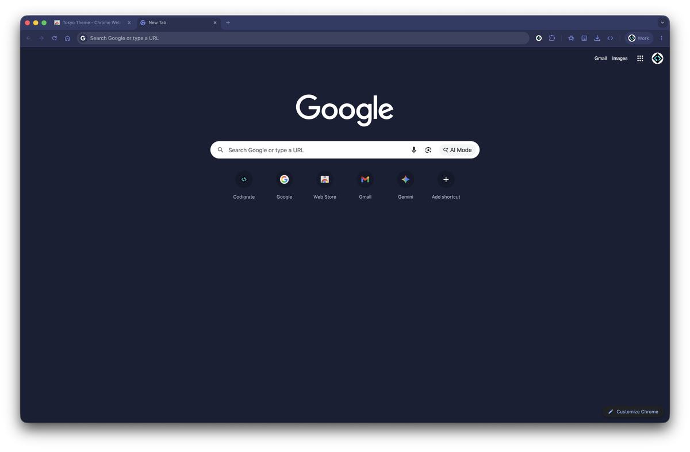

## Color Palette

<table>
   <tr>
      <td></td>
      <td>
         Background
      </td>
      <td>
         <a href="https://codigrate.com/en-US/tools/color/1A1F35">#1A1F35</a>
      </td>
   </tr>
   <tr>
      <td></td>
      <td>
         Frame
      </td>
      <td>
         <a href="https://codigrate.com/en-US/tools/color/323B66">#323B66</a>
      </td>
   </tr>
   <tr>
      <td></td>
      <td>
         Accent
      </td>
      <td>
         <a href="https://codigrate.com/en-US/tools/color/7285DC">#7285DC</a>
      </td>
   </tr>
</table>

## Collections

   

<h1 align="center">
All In One Themes
</h1>

## Description

All in One Themes is the complete theme experience in a single package,
bringing together all Codigrate themes into one unified collection for JetBrains IDEs.
From calm, light environments inspired by natural landscapes to rich,
cinematic dark themes shaped by iconic cities, this bundle lets you switch moods, lighting,
and atmosphere without disrupting your workflow.

## Screenshots

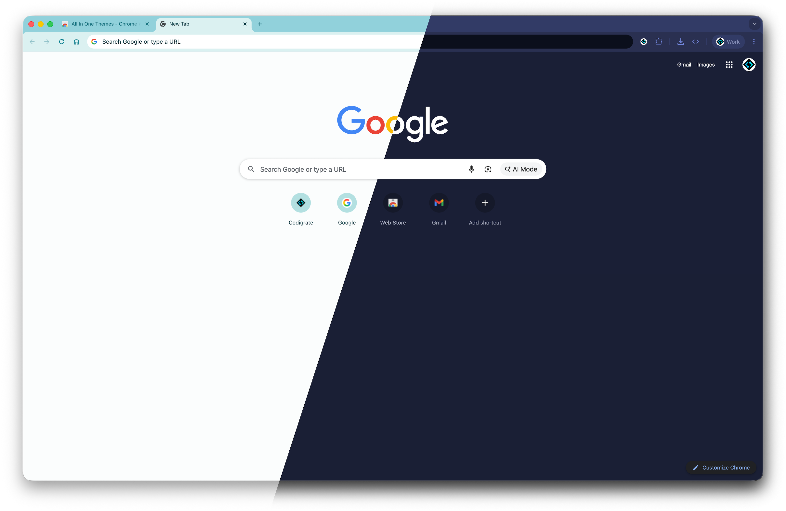

## Contributors

<!-- ALL-CONTRIBUTORS-LIST:START - Do not remove or modify this section -->
<!-- prettier-ignore-start -->
<!-- markdownlint-disable -->
<table>
   <tr>
      <td align="center"><a href="https://github.com/furknyavuz"> <b>Furkan Yavuz</b></a> </td>
      <td align="center"><a href="https://github.com/kerimalp"> <b>Kerim Alp Kaya</b></a> </td>
   </tr>
</table>
<!-- markdownlint-enable -->
<!-- prettier-ignore-end -->
<!-- ALL-CONTRIBUTORS-LIST:END -->

## LICENSE

The source code for this project is released under the [MIT License](LICENSE).

 

<table align="right">
   <tr>
      <td></td>
      <td><b>Codigrate © 2026</b></td>
   </tr>
</table>